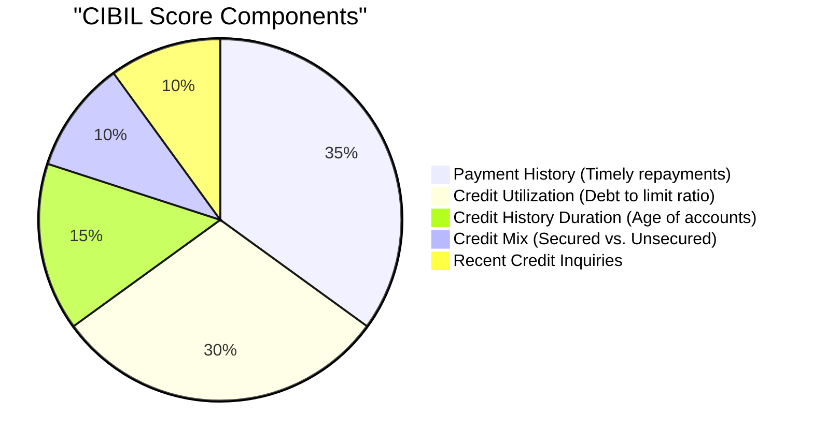

When you apply for a Home Loan, Car Loan, or a Credit Card in India, the very first thing a lender checks is your **Credit Score** (often referred to as your CIBIL score). 

Your credit score is a three-digit numerical summary of your credit history, ranging from **300 to 900**. In simple terms, it tells banks how reliable you are at repaying debts.

A high credit score can save you lakhs of rupees in interest rates, while a poor score can lead to loan rejections or high interest charges. In this guide, we will look at how credit scores are calculated in India, how they impact your loans, and how to maintain a score of **750 or above**.

---

## How Your CIBIL Score Affects Loan Interest Rates

Many first-time borrowers do not realize that banks practice **risk-based pricing**. This means that the interest rate you are offered is directly linked to your credit score. Lenders offer their best interest rates to borrowers with excellent credit histories and charge a premium to those with lower scores.

Let's see how a credit score difference affects a **₹50 Lakh Home Loan** with a 20-year tenure:

| CIBIL Score Category | CIBIL Score | Typical Interest Rate | Monthly EMI | Total Interest Paid |
|----------------------|-------------|-----------------------|-------------|---------------------|
| **Excellent**        | 775 - 900   | **8.40% p.a.**        | ₹43,075     | ₹53.38 Lakhs        |
| **Good**             | 700 - 774   | **8.85% p.a.**        | ₹44,505     | ₹56.81 Lakhs        |
| **Average / Poor**   | Below 700   | **9.60% p.a.**        | ₹46,957     | ₹62.70 Lakhs        |

By improving your CIBIL score from below 700 to above 775, you save:
* **₹3,882 every month** on your EMI.
* **Over ₹9.3 Lakhs in total interest** over the loan tenure!

*(You can run your own interest calculations and prepayment strategies using our **[Home Loan Calculator](/home-loan-calculator/)** or **[Car Loan Calculator](/car-loan-calculator/)**).*

---

## How is Your Credit Score Calculated?

In India, credit bureaus like TransUnion CIBIL, Experian, Equifax, and CRIF High Mark calculate credit scores based on data submitted by banks and financial institutions. 

CIBIL calculates your score using five key factors:

1. **Payment History (35% weight):** Have you paid your EMIs and credit card bills on time? Even a single payment delayed by more than 30 days can pull your score down significantly.
2. **Credit Utilization Ratio (30% weight):** How much of your available credit card limit are you using? Ideally, you should keep your utilization **below 30%** of your total limit. Using 90% of your credit card limit signals "credit hunger" and hurts your score.
3. **Credit History Length (15% weight):** The age of your oldest active credit accounts. A longer history of responsible credit management increases lender confidence.
4. **Credit Mix (10% weight):** Having a balanced mix of secured loans (like home or car loans) and unsecured credit (like personal loans or credit cards) is viewed positively by bureaus.
5. **Recent Inquiries (10% weight):** Every time you apply for a loan or credit card, the lender makes a "hard inquiry" on your credit profile. Multiple hard inquiries in a short period suggest financial distress, dropping your score.

---

## Actionable Tips to Maintain a 750+ CIBIL Score

Maintaining a high credit score is not difficult if you build disciplined financial habits:

* **Never Miss a Payment Date:** Set up automated standing instructions or auto-debits for your credit card bills and loan EMIs to avoid late fees and payment delays.
* **Keep Utilization Low:** If your credit card limit is ₹1,00,000, try not to spend more than ₹30,000 on it in a billing cycle. If you have a major expense, pay it off immediately before the statement is generated, or request a limit increase.
* **Do Not Close Old Credit Cards:** Keep your oldest credit card active, even if you do not use it frequently. It establishes the length of your credit history.
* **Avoid Too Many Loan Applications:** If you need a loan, compare options online instead of submitting formal applications to multiple banks at once. Each formal application triggers a hard inquiry.
* **Check Your Report Regularly:** Under RBI guidelines, you are entitled to **one free credit report** every year from each credit bureau. Check your reports for any errors (such as loans you have already closed showing as active) and dispute errors immediately on the bureau's website.
